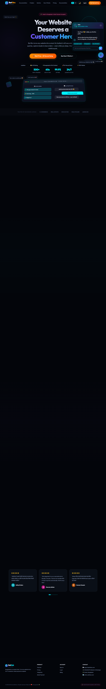

<div align="center">
  
  <h1>🕷️ BotBro</h1>
  <p><strong>The Intelligent AI Chatbot Builder for Modern Websites</strong></p>
  <br/>
  
</div>

<br/>

## 🌟 What is BotBro?

BotBro is a powerful, low-code Software-as-a-Service (SaaS) platform that allows any business to build, train, and deploy an intelligent AI chatbot in under 60 seconds. 

By simply pasting a website URL, BotBro scrapes the website, processes the text into a vector database, and trains a highly capable AI assistant that can answer customer questions, recommend products (complete with images and links), and capture leads upfront.

---

## 🚀 Key Features

*   **⚡ 60-Second Setup:** Paste your website URL, and BotBro crawls and learns your entire site automatically.
*   **🕷️ Intelligent Scraping:** Integrates a powerful background scraper that maps your site architecture and extracts meaningful text, product names, and pricing.
*   **🧠 Semantic Memory:** Uses advanced embeddings (ChromaDB) to accurately match customer queries with your business's specific knowledge base.
*   **👥 Upfront Lead Capture:** Forces users to input their Name and Phone Number before chatting, storing them securely in your dashboard for future marketing.
*   **💬 Modern Widget:** A beautifully designed, glassmorphic chat widget that you can easily embed into any website by pasting a single script tag.
*   **📎 Rich Media Attachments:** Customers can attach images in the chat widget for more context.
*   **🎨 Custom Branding:** Change your bot's name, primary colors, and welcome messages directly from the dashboard.

---

## 💻 Tech Stack

*   **Frontend:** HTML5, Vanilla JavaScript, CSS3 (Glassmorphism, Modern UI)
*   **Backend:** Python (FastAPI)
*   **AI/Vector Database:** ChromaDB, OpenAI/Gemini (LLM routing)
*   **Web Scraping:** BeautifulSoup4, Requests
*   **Database:** SQLite

---

## 🛠️ How to Run Locally

### 1. Clone the repository
```bash
git clone https://github.com/sunviraj/BotBro.git
cd BotBro
```

### 2. Set up a virtual environment
```bash
python3 -m venv venv
source venv/bin/activate
```

### 3. Install Dependencies
```bash
pip install -r requirements.txt
```

### 4. Run the API Server
```bash
python api/main.py
```

### 5. Launch the Dashboard
Open `index.html` or `dashboard/login.html` in your favorite modern browser.

---

## 📖 Documentation

A comprehensive guide for non-technical users is available in the `docs.html` file included in this repository. It covers creating accounts, training bots, and installing the widget on Shopify, Wix, or custom websites.

---

<div align="center">
  <p>Built with ❤️ by Editians.</p>
</div>
